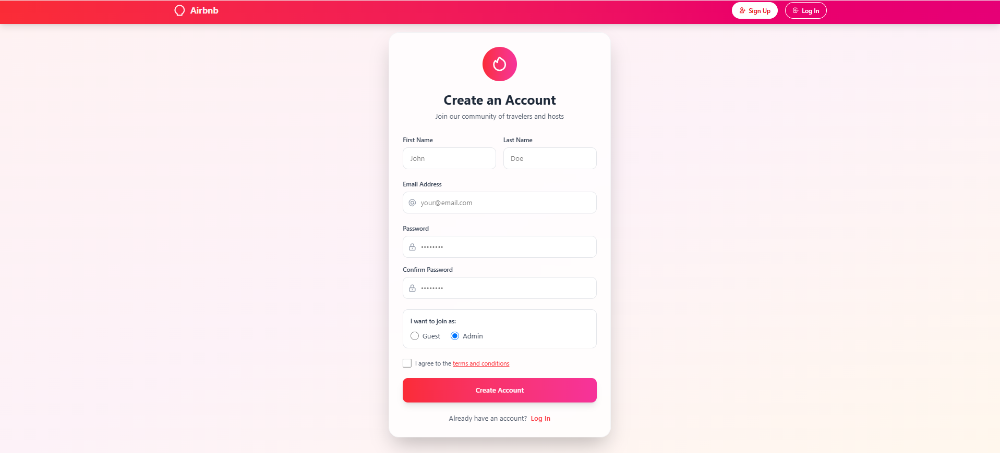

# Airbnb Website Clone with MongoDB

A full-stack Airbnb-inspired property listing and booking web application built with Node.js, Express, MongoDB, EJS, and Tailwind CSS.

## Features

- **User Authentication:** Sign up, log in, log out with secure password hashing.
- **User Roles:** Guest and Admin user types with different permissions.
- **Property Management:** Admins can add, edit, and delete property listings with image uploads.
- **Property Listings:** Users can browse, search, and view details of available homes.
- **Favorites:** Users can add/remove homes to their favorites list.
- **Booking System:** Users can book properties and view their bookings.
- **Responsive UI:** Modern, mobile-friendly design using Tailwind CSS.
- **Session Management:** Secure sessions stored in MongoDB.
- **Validation:** Robust form validation using express-validator.
- **Image Uploads:** Handled via Multer middleware.
- **Error Handling:** User-friendly error messages and redirects.

## Tech Stack

- **Backend:** Node.js, Express.js
- **Database:** MongoDB (Mongoose ODM)
- **Frontend:** EJS templates, Tailwind CSS
- **Authentication:** express-session, bcrypt
- **File Uploads:** Multer
- **Validation:** express-validator

## Folder Structure

```
├── controllers/
├── models/
├── routers/
├── middlewares/
├── views/
│   ├── admin/
│   ├── auth/
│   ├── partials/
│   └── store/
├── public/
│   └── css/
├── .env
├── index.js
└── README.md
```

## Getting Started

1. **Clone the repository:**

   ```bash
   git clone https://github.com/Deeppatel-4032/Airbnb-web-NoSQL-DB
   cd Airbnb-web-NoSQL-DB
   ```

2. **Install dependencies:**

   ```bash
   npm install
   ```

3. **Set up environment variables:**

   - Copy `.env.example` to `.env` and fill in your MongoDB URI and desired port.

4. **Run the app:**

   ```bash
   npm start
   ```

5. **Visit in your browser:**
   ```
   http://localhost:3003
   ```

## Tools & Libraries Used

- [Node.js](https://nodejs.org/)
- [Express.js](https://expressjs.com/)
- [MongoDB](https://www.mongodb.com/)
- [Mongoose](https://mongoosejs.com/)
- [EJS](https://ejs.co/)
- [Tailwind CSS](https://tailwindcss.com/)
- [Multer](https://github.com/expressjs/multer)
- [express-session](https://github.com/expressjs/session)
- [connect-mongodb-session](https://github.com/mongodb-js/connect-mongodb-session)
- [bcrypt](https://github.com/kelektiv/node.bcrypt.js)
- [express-validator](https://express-validator.github.io/docs/)

## Screenshots

## Screenshots

.png>)

.png>)
.png>)
.png>)
.png>)

MIT

## GitHub

[GitHub Repository](https://github.com/Deep-patel4032/airbnb-website-mongodb-database)
